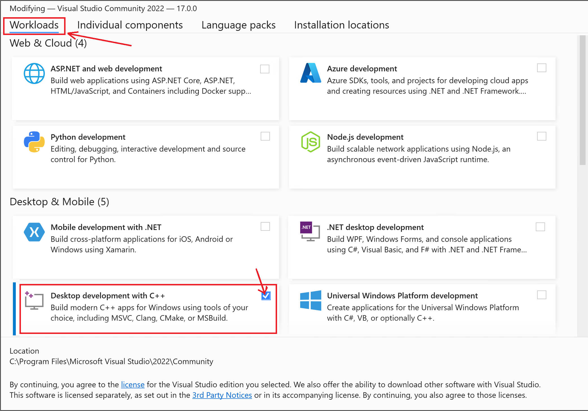

Get Started
============

several links:

#. `pypi, torchbox <https://pypi.org/project/torchbox/>`_

#. `github, torchbox <https://github.com/antsfamily/torchbox/>`_

#. `document, torchbox <https://iridescent.ink/torchbox/>`_

Installation
-------------

The `torchbox <https://pypi.org/project/torchbox/>`_ package can be easily installed by ``pip install torchbox``. After it is installed, just excute ``import torchbox as tb`` to import the package.

.. important:: If you want to install torchbox on Windows system. The C/C++ build tools should be installed firstly! Just download it from `here <https://visualstudio.microsoft.com/visual-cpp-build-tools/>`_ , and select the follow components to install.

